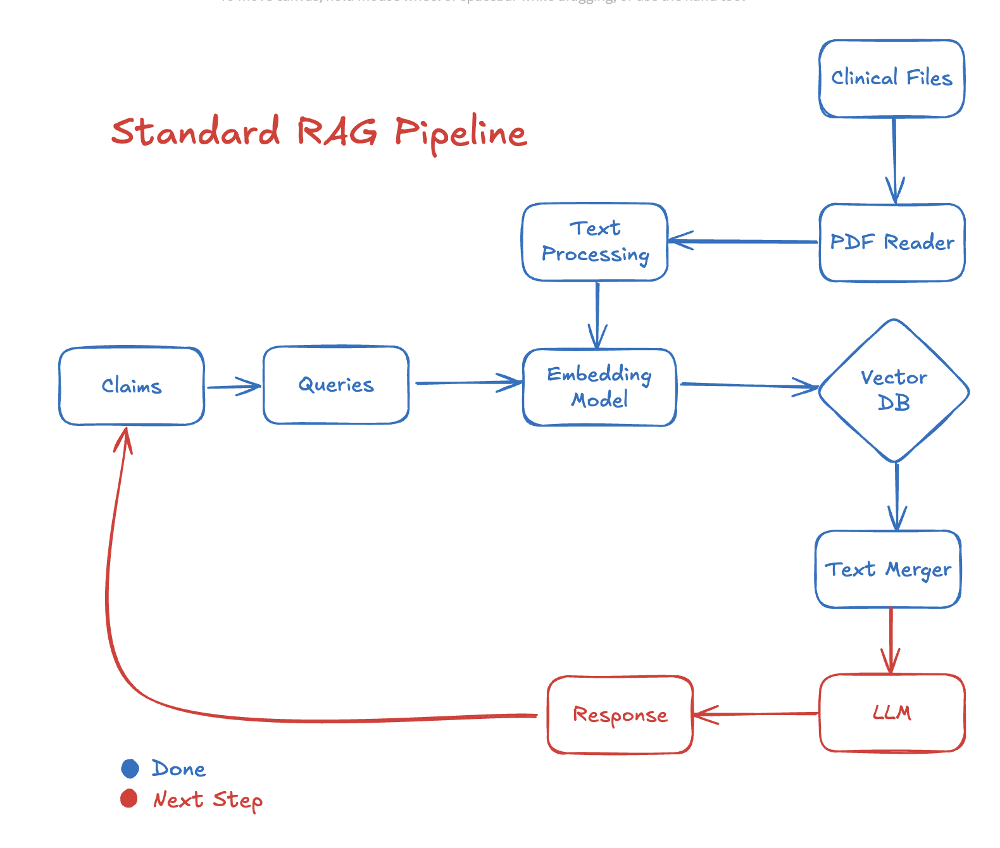

# Health Facts Check


## Overview

Given a set of clinical PDFs and a JSON list/image of marketing claims. 

For each claim, the most relevant supporting evidence (paragraphs, tables, figures) from the clinical documents. The output is a JSON mapping to match claim to  matches with paragraphs, tables, and figures.


### Inputs
**Claims:** provided as JSON (no OCR needed for claims per instructions).
**Clinical sources:** eight PDFs.

Sample input:
```json
{
    "claims": [
        {
            "claim": "..."
        },
        {
            "claim": "..."
        }
}
```

### Output


```json
{
  "claims": [
    {
      "claim": "...",
      "matches": [
        {
            "document_name": "...", 
            "page": 3, 
            "matching_table_fig": [...], 
            "matching_text":"..."},
      ]
    }
  ]
}
```

## Key Challenges

There are many challenges and further improvement for this project. I have provided a MVP of this assessment. 

1. **Robust PDF parsing**
   * Preserve spaces and reading order; (e.g., `influenzavaccinefieldhas`).
2. **Tables & numbers**
   * Claims contain specific values, units, and ratios (e.g., “45 mcg vs 15 mcg”, “3×”).
3. **Better Embeddings**
   * Generic embeddings capture medical semantics.

## Technical Details (MVP)




1. **PDF Processing**

   * **Text**: Use `pypdf` to get page text.
   * **Tables**: Tried Camelot but not working well. Now will embedd the whole table.

2. **Chunking**

 * To prevents embedding out of token limit, so we keep chunk_size modest 1000 charts and seprate by preiod.
 * To preserves meaning at boundaries, so also included chunk_overlap ~20%.

3. **Embedding**

   * Model: `sentence-transformers/all-MiniLM-L6-v2` Max 512 tokens.


4. **VectorDB**

   * As MVP we choose to use in memory vectorDB Faiss.
   * Similarity Search metric: cosine similarity.

5. **Retrieval & Scoring**

   * Embed claim and FAISS search to get top k relevant paragraphs.

6. **Output Formatting**

   * Output a JSON for spec with `document_name`, `page`, `matching_table_fig`, and `matching_text`.

## Evaluation

Based on GPT's Response, the result meet expectations. 

## Further Improvement

1. **Medical embeddings**  Better embeddings tuned for clinical language (e.g., BioClinicalBERT, SapBERT).
2. **OCR** for low-quality pages, or scanned pages.
3. **Layout parsing** for section recognition, having bounding box for titles, images, paragraphs, and tables.  (e.g., https://github.com/Layout-Parser/layout-parser). 
4. **Agentic RAG** to iteratively refine matches and generate short rationales explaining why a snippet supports a claim.
5. **VLM/Image Captioning** get more if images carry evidences.
6. **OOV** could happen due to abbreviations, medical terms. Solution could be having a dictoary to replace them or better medical embedding could also work.
7. **Numeric/keyword** could be important in our case, adding exact match could also help.


## Getting Started

### Installation
Enviroment: >= Python3.10

```bash
pip install -r requirements.txt
```

### Start the Pipeline

Run python script to get the `clamin_doc_search.json`.

```bash
python3 get_doc.py
```

